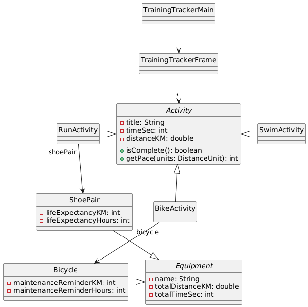

# CSSE 220 Milestone 0 Report
**Project Title**: Endurance Sports Training Tracker

**Team Name**: Ludden and the Lopers

**Team ID**: F25_A001

**Team Members**: 
- Ian Ludden (luddenig)

---
## Section 1: System Description
An endurance sports (running, cycling, swimming) training tracker app provides a graphical user interface for an athlete to log workouts and track progress over time. The user interface has three different panels: a Calendar panel, defaulting to a month view and showing each day's activities; a Stats panel, showing weekly summaries and breakdowns of activity types with line charts and pie charts; and an Activity panel for creating/editing activities. 

Each activity can either be planned or completed. Supported activity types include Run Activity, Bike Activity, and Swim Activity. Every activity includes basic information such as title, description/notes, distance (in units set as a global configuration), and time, from which other stats can be computed. Each run activity additionally has a designated shoe pair, used to keep track of mileage on each pair of shoes for maintenance/replacement purposes. Similarly, each bike activity has a designated bicycle for tracking hours since last service. 

The user can drag-and-drop activities around to different days on the calendar, and each day can contain multiple activities. An activity can be deleted by selecting it with a click, then pressing the "Delete" key, with a confirmation pop-up to avoid accidental deletions. An activity can be duplicated by selecting it with a click, then pressing "Shift+D", creating a new activity on the same day with the same details except " - Copy" appended to the name. 

## Section 2: Outline of Remaining Milestones
*DONE: Add tasks/deliverables you have planned for each milestone below. If you took the option of having a genAI tool create an initial draft of milestones, include a link to your conversation at the top of this section.*

The following milestones were adapted from [this Claude.AI conversation](https://claude.ai/share/6f0721ba-9b3b-4b05-a5fc-9283f5f372d0). 

### M1 - Foundation and Core Architecture
1. Implementation of core data model classes: 
  - Abstract `Activity` class with concrete subclasses: `RunActivity`, `BikeActivity`, and `SwimActivity`
  - Abstract `Equipment` class with concrete subclasses: `ShoePair`, `Bicycle`
2. File I/O for saving/loading list of activities: 
  - Activity to/from JSON conversion methods
  - Custom exceptions: `InvalidActivityFormatException`, `FileCorruptedException`
  - Simple file read/write operations with exception handling
3. JUnit tests for `Activity` and `Equipment` classes
4. Basic Swing window structure with placeholder panels

### M2 - Data Management and User Interface Structure
1. Data management system: 
  - `ActivityManager` class using `HashMap<LocalDate, ArrayList<Activity>>`
  - Calendar data model with date-based activity retrieval
2. Swing GUI implementation:
  - `CardLayout` for switching between Calendar, Activity, and Stats (placeholder for now) panels
  - `CalendarPanel` class with basic month view grid, automatically set to show the current month, and with buttons for jumping a week/month forward/backward
  - `ActivityPanel` class with form for selecting activity type and entering details
  - Menu bar for navigation, with file load/save, edit to change panel or add/edit/delete activity, and help pop-up
3. Expanded JUnit tests for `ActivityManager` class

### M3 - Advanced Features and Interactivity
1. Move/edit functionality for activities in calendar
  - keyboard shortcuts for duplicating/deleting selected activity
  - handle mouse events to select, drag, and drop activities
  - fall-back option: keyboard shortcuts for activity cut/copy/paste
2. Display equipment maintenance notifications
  - Pop-up dialogs, or banners along the top of the window
3. Configuration system
  - User can edit global settings like distance units and default values
  - Config settings are saved to a config file which is loaded (or created, if missing) when the application restarts

### M4 - Stats Panel and Polish
1. Implement `StatsPanel` class summarizing select week's activities
2. Add ease-of-use/accessibility features like keyboard navigation with tab and other keyboard shortcuts
3. Clean up code to follow CSSE 220 documentation and style guidelines

## Section 3: Potential Classes
- Activity (Abstract)
    - RunActivity
    - SwimActivity
    - BikeActivity
- Equipment (Abstract)
    - ShoePair
    - Bicycle
- ActivityManager
- CalendarPanel (JPanel)
- ActivityPanel (JPanel)
- StatsPanel (JPanel)
- DayPanel (JPanel)
- Config (singleton)
- DistanceUnit (enum)
- TrainingTrackerMain
- TrainingTrackerFrame (JFrame)

## Section 4: Draft of UML for M1

[PlantUML link](https://www.plantuml.com/plantuml/uml/TPBXJi8m4CU_zocQVGB9Nc0V22eO4qD263v0rnrueUrcUrKNzTtjs1YhuXV8tR_tozqlMpWIbhnMp1tHrC8ApHqr2iAlHNbAc5J2ERwp0WsQG_YNHx3hKF5FzlrF_118qENN1jCodLyTOKmKZaA3UCUzbOHlI4rWfOIa8ECvsJ3LbXfoa1b7GomjqP4m4fxM6IyhNoXWCtJtbQuL44oc6I-gIe4mR7O0sWW94s-GNCQN_UHpAASTRLWxtkwqTtAJ35kThzzwSswDfTpX4UB--67wDR-0egUfhwCmVqTz2HNiAOf_ErkzUgmr66gb6Q77pYeIQlbNLHViHaRvvOpyfOADGDlY5EvXzL63R0bD87Jsu_PZvQthaf4BsKW5BKEBa81fLzY2HbE27K1NifWsBDCg62vbFJxknhuJruycwNouAHQV51qcENsWFPCjm9HUgny0)
