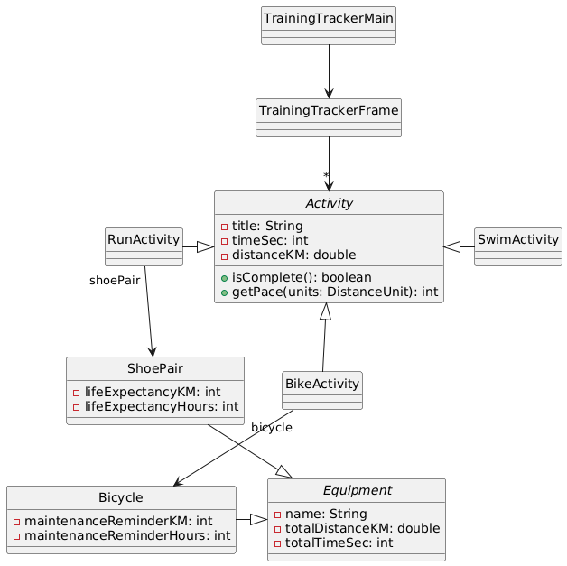
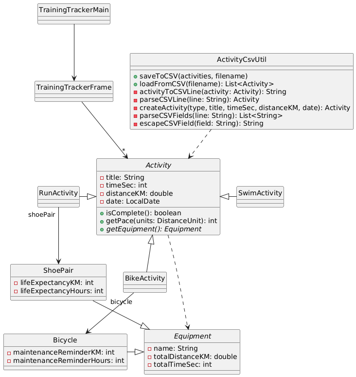
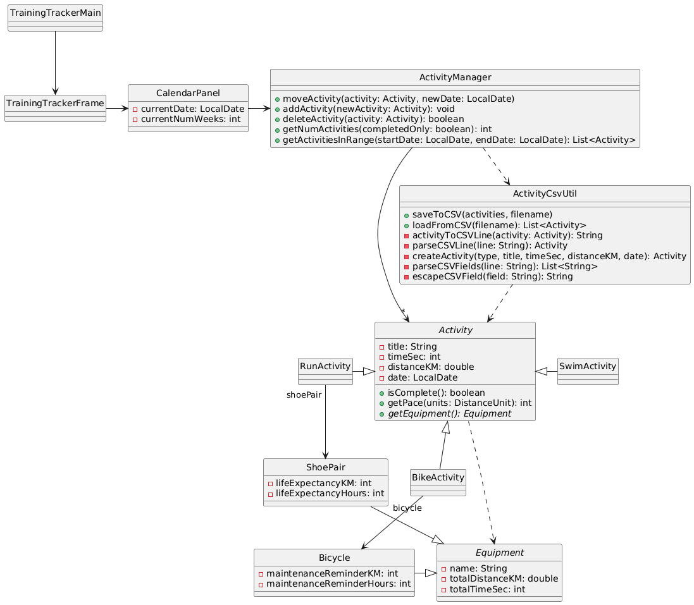

# CSSE 220 Milestone 1 Report
**Project Title**: Endurance Sports Training Tracker

**Team Name**: Ludden and the Lopers

**Team ID**: F25_A001

**Team Members and Role(s) for this Milestone**: 
- Charlie (charlie1), Reviewer $\to$ Navigator
- Brandon (brandon2), Navigator $\to$ Driver
- Allison (allison3), Driver $\to$ Tester
- Dani (dani4), Tester $\to$ Reviewer

---
## Section 1: Progress Summary and Individual Contributions
*DONE for Driver: Give a high-level summary of your team's progress on this milestone. Did you accomplish all planned tasks? If not, which ones did you fully complete, and which ones still need some work? How far along are the incomplete tasks?*

We successfully completed all planned tasks for M1. We created the essential data model classes (Activity, Equipment, and subclasses), implemented activity saving/loading to files, and set up the basic GUI structure. The file I/O methods use our custom exception types. 

*TODO for Driver: List the role, main contributions, and estimations of time spent working on the project as a group (2 or more) and individually (working alone).*

| Name    | Role      | Main Contribution(s)                                                         | Est. Hours with Group | Est. Hours Individually |
| ------- | --------- | ---------------------------------------------------------------------------- | --------------------- | ----------------------- |
| Charlie | Reviewer  | First Draft of UML identified a bug in code (null) Completed M1 report | 2 hours               | 2 hours                 |
| Brandon | Navigator | Pair programmed Set meeting agendas                                       | 4 hours               | 1 hour                  |
| Allison | Driver    | Pair programmed Scheduled group meetings                                  | 4 hours               | 1 hour                  |
| Dani    | Tester    | Wrote JUnit tests                                                            | 2 hours               | 2 hours                 |

*TODO for Driver: Provide a direct link to your project repo's contributions page here, with the dates for this milestone selected. It will look something like this:
`https://github.com/rhit-csse220/csse220-TERM-final-project-team-TEAM_NAME/graphs/contributors?from=2022-02-09&to=2022-02-26&type=c`*

*This can be found by going to your team repo and then selecting
Insights->Contributors from the top menu
See this [comprehensive guide to viewing contributions](https://docs.github.com/en/repositories/viewing-activity-and-data-for-your-repository/viewing-a-projects-contributors).*

*If for some reason your contributions to do not show up, please review [this guide](https://docs.github.com/en/account-and-profile/setting-up-and-managing-your-github-profile/managing-contribution-settings-on-your-profile/why-are-my-contributions-not-showing-up-on-my-profile#your-local-git-commit-email-isnt-connected-to-your-account).*

[Link to Project Contributions Page](https://example.com)

## Section 2: UML Before and After
*DONE for Navigator: Copy the originally planned PlantUML diagram for this milestone below.*

*DONE for Navigator: Update the UML to reflect your current implementation.*
[PlantUML link](https://www.plantuml.com/plantuml/uml/TLDXRzem4FsUNs7b4mpI7n1Dg1ijchHMgWhTT-CStGd7oUmB6-hwttScs8aP_M9yzvwV_Tw5MqVIKbVhpEtHjDBAMZWwQk3LeZeXcTBIER6n4WsQL_vLUx2FN8ctxFq3UCLAqEFN3XPLiRXw9ClarX4tIFIwNnJX0Ud8MWKXQIZ5cYoVycKDQr2bG4DPKI5xCGg-FvQYQhgj1kv9Olv3ewI-usqsGxTiwbO3mMHQYctJQ90ccxq2FKa5ayuWkLBSdQLUk9psyc_XMU-UVF-hmxO6Grub5gdPmTF9RVufZrv2Pi-T2Qrnb5zn3sb_J2p-BWQXX5fqRGAkVsCzW1fsbC2NIKSVFceZwt7I3N62_mVS0vlH7CHWO_spWIU9rijftC7zdnQKLpXw1UPUjhyrdNKzCif27PK6hr5BHi0m4vwXHbE13KBNi5GjFiP7C4mioAVT9E_SdO_cnI9wIeFFjxrCxWSTdXmS1DRI7Lu8DJkPENc0JRDS_vZ87aHmSx533JxsQJRJZQnMjgaz9RRvGqP7duFU8YlaUNlIUa03az0fuxNJOOgjj0u2K_CIeEb0pmfbGLBqDg5Z2tD1IDh_z9EUY-7Fndkc9mhXdXM2hbnoKp3HLsm1d99j9BDPNYCvRFm0BsEykHa-vGXoTpp7Mp1LL-j_)

*DONE for Navigator: Discuss the changes to your team's design.*

Our Activity class was missing the important `date` field, so we added it. Activity also needed a `getEquipment` method, which is abstract. We also forgot to include our activity file I/O class, but added it now. 

*TODO for Navigator: Expand the current UML to include the next milestone's features.*
We plan to switch from using a `JPanel` for adding/editing activities to using a `JDialog`, so we have renamed `ActivityPanel` to `ActivityDialog`. We are also switching from the plan of a Swing `CardLayout` to a `JTabbedPane` for switching between the calendar and statistics views. See [revised M0 report](../m0/M0_Report.md) for the updated M2 plan. 

[PlantUML link](https://www.plantuml.com/plantuml/uml/VLLDRniX4BtpAv1FwzgR7s1LLbedKQicRHGdxNaCOnUPZosmJgqq_xsGNHQpSdjPmxp7OsPuu4ldmVfMIUBsGZTWGL7dZnB3rmhsXX0cmJdwQ45eeNVXb-tHteKPVI6l_u1lWX9s-Bc5DQ-NPvSG0XldGy3JJlS3y-8W_35erLvuYGkwzZQiYbE5QsGBAhGdDHVEWsRuvMv1kMat4aCCVE3V6WRoAWp9JBYLKOr4ZzLqGJV6I0HDPZlqzy2mQhNmRa6lUgcdC9rsyYyfhTT8llxLYaQXzb5bcCHYowJlGCCERSXzfim1KxY2Vh0Oc7EgyVcgJ7TAPi3vi2WGqZYl2_iVZE1anb6Y_zyEetg_jgf71BgAzLtXtxGy3iI-zaZFtC_w0VGEgpVdZ3AUKzHyN4KO2-VVfpoMiKtZ1aK_JDvDXcHJ8nzQdKAdPliezbZ6JudrdsKMAgXrsnJW-bce34hS-W8UUJ6VT3IZ1dNgHUD3kMCBOWyydZYLvZBMFmtUWx1HJeejNlzka4M5Or28t77uascjwv2JNh0ZanWr50G4TKpX0PNG76qIEeULQaCoiGNPqqc-Z1RzdhX-wQHU3ZMLZPziEfb9FEYKylYshDpXoGiPRuk30pwQrVfx1OFnvdGh96fGyM980_p66XKfVVYCqsheXszQjqBZ-OkHJh41wp0nPVWaQ9hff6OMuUIg-ME3SnhVflZJdVISvkSeZ0EzK4Zxt0YKt1KxfIAwMIW17ODc85VR-CtaVf3lL6xZnKMsyW36Q3x7yJtCQx9EEgKLIDGSx3rebD5jhBKMzVW9IF7umFn0t6U3dVs7g9UbC2bc4HwbICXbm5ib_m80)

## Section 3: Teamwork Reflection
*TODO for Reviewer: Reflect on what the team did well this milestone and how it can improve. Feel free to add additional sections/subsections or other notes.*

### 3.A: What our team did well

### 3.B: What our team could do better in the next milestone

## Section 4: Meeting Minutes
*TODO for Reviewer: Use this section to add minutes (i.e., detailed notes) from all team meetings, excluding pair programming. Feel free to modify the template below to your liking. **Teams of size two can skip this section.***

### Meeting #1
- Day/Time: January 2, 7-9 p.m.
- Present: Allison (driver), Brandon (navigator), Charlie (reviewer), Dani (tester)

**Agenda**:
1. Discuss new source code files created since last meeting
2. Develop UML for the next milestone
3. Brainstorm how to implement next feature

**Minutes**:
1. Notes on Agenda Item #1
2. Notes on Agenda Item #2
3. Notes on Agenda Item #3

**Next Action Items**:
- Allison will ...
- Brandon will ...
- Charlie will ...
- Dani will ...

## Section 5: Testing
*DONE for Tester (or Navigator, on a team of size 2-3): Complete the below summary of your JUnit tests from this milestone. Every team is expected to add some JUnit tests as part of each milestone, but teams of size 2-3 are not expected to create as many test cases.*

### A. Testing code written for this milestone
- Where is the test located? (e.g., `src/test/FileIOTest.java`)
    - `src/test/ActivityTest.java`
    - `src/test/EquipmentTest.java`
- What functionality is the test verifying?
    - Activity object creation, editing, pace calculation, and completion checking. 
    - Equipment object creation, toString, and maintenance tracking. 

### B. What is your **plan** for testing (writing a unit test(s)) in the next Milestone?
- What do you plan to test for the next milestone? 
The new `ActivityManager` class, including its `moveActivity`, `addActivity`, `deleteActivity`, `getNumActivities`, and `getActivitiesInRange` methods. 
- Give examples of 3 different inputs and their expected outputs.
  1. Initially, `getNumActivities` should return `0` (for both `true` and `false`). After calling `addActivity` three times, it should return `3`. 
  2. If there are 8 activities and only five are completed, then `getNumActivities(false)` should return `10`, and `getNumActivities(true)` should return `5`. 
  3. If there is one activity on August 4, two on Aug 5, and one on Aug 6, then `getActivitiesInRange` with a start date of Aug 4 and end date of Aug 6 should return a list of all four activities. After calling `moveActivity` on the Aug 4 activity to move it to Aug 3, the same call to `getActivitiesInRange` should return only the other three activities. And after calling `moveActivity` on one of the Aug 5 activities to move it to Aug 10, `getActivitiesInRange` with a start date of Aug 8 and end date of Aug 11 should return a list with just that activity. 

### C. Reflection on Testing Plan
- Did you have to adjust the originally planned test(s) for this Milestone? 
No. 
- Describe how the implementation of the tests in this milestone was either easy or challenging. 
The tests for `Activity` and `Equipment` were easy to implement because most test cases involved constructing an object or two, then calling one or two methods. There was not much need for setup. 
